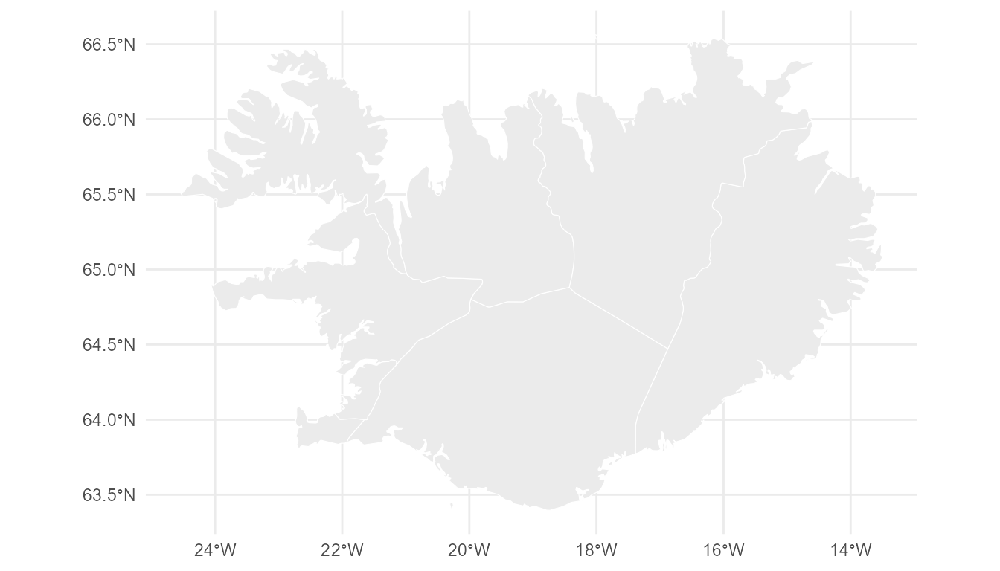

# Building a Geoscale from Natural Earth

``` r

library(geoscales)
```

## The package ships no maps

`geoscales` contains integration code, not data. There is no `data/`
directory and no bundled boundaries. A provider fetches a source table;
the package records what was fetched.

``` r

list_geo_providers()
#>           name                                          desc
#> 1 naturalearth Natural Earth admin-0/admin-1 (rnaturalearth)
```

Natural Earth is the default provider because its country table is
*already* a wide leaftable — one `sf` object carries the whole nest as
columns:

    continent (8) -> region_un -> subregion (22) -> sovereignt
                  -> admin / adm0_a3 (177) -> geounit -> subunit

with `pop_est` and `gdp_md` as ready-made weights.

``` r

gs <- ne_geoscale(scale = 110)
gs
#> Geoscale: naturalearth-110 
#> Description: Natural Earth admin-0 hierarchy 
#> Geoframes (4, coarsest first):
#>   - continent (8)
#>     - subregion (22)
#>       - country (177)
#>         - feature (177)
#> Atoms: 177
#> Weights: pop_est, gdp_md (default: pop_est)
#> Source: naturalearth
#> Geometry: attached (177 features)
```

## Aggregating up

We will follow Iceland through the hierarchy. It sits in Northern
Europe:

``` r

lf <- S7::prop(gs, "leaftable")
lf[lf$country == "ISL", c("continent", "subregion", "country", "pop_est")]
#>     continent       subregion country pop_est
#> 145    Europe Northern Europe     ISL  361313
```

Rolling population up from countries to sub-regions is one call.
`rule = "sum"` because population is *extensive* — it adds up:

``` r

pop <- data.frame(country = lf$country, pop = lf$pop_est)
pop <- pop[!is.na(pop$country), ]

agg <- recast_geoscale(pop, gs, from = "country", to = "subregion", rule = "sum")
agg[agg$subregion == "Northern Europe", ]
#>          subregion       pop
#> 11 Northern Europe 105135601
```

## … and back down

The same verb runs the other way. Going down, `rule = "sum"` splits a
total in proportion to a weight, so the total is conserved:

``` r

ne <- agg[agg$subregion == "Northern Europe", ]

back <- recast_geoscale(ne, gs, from = "subregion", to = "country",
                   rule = "sum", weight = "pop_est")
#> Warning: 21 source region(s) present in the Geoscale but missing from `x` (e.g.
#> Antarctica, Australia and New Zealand, Caribbean, ... (21 total)); produced NAs
head(back[order(-back$pop), ], 4)
#>     country      pop
#> 144     GBR 66834405
#> 111     SWE 10285453
#> 143     DNK  5818553
#> 152     FIN  5520314
```

Because we split by the same quantity we aggregated, the round trip is
exact:

``` r

back$pop[back$country == "ISL"]
#> [1] 361313
sum(back$pop) == sum(ne$pop)
#> [1] NA
```

That is the whole idea: **aggregation and disaggregation are one
operation.** Direction follows the geoframe ranks, and
[`recast_geoscale()`](https://optimal2050.github.io/geoscales/r/reference/recast_geoscale.md)
routes through the atom layer either way.

## Iceland’s own regions

Natural Earth’s admin-1 layer gives sub-country units. This needs
`rnaturalearthhires`, which is **not on CRAN**:

``` r

install.packages("rnaturalearthhires",
                 repos = "https://ropensci.r-universe.dev")
```

``` r

s <- ne_source(geoframe = "states", country = "Iceland")
d <- as.data.frame(s)
nrow(d)
#> [1] 9
```

Nine units — but Iceland has eight regions. `Reykjavik` and the
surrounding capital area are separate admin-1 features that belong to
the same region, which Natural Earth records in `gn_name`. That gives a
genuinely **ragged** hierarchy: one group with two children, seven with
one.

``` r

isl <- data.frame(
  country    = "ISL",
  landshluti = d$gn_name,       # Iceland's eight regions
  unit       = d$iso_3166_2,    # the nine Natural Earth units
  stringsAsFactors = FALSE
)

g <- geoscale_from_leaftable(isl, geoframes = c("country", "landshluti", "unit"),
                          key = "unit", name = "iceland")
g <- attach_geometry_geoscale(g, s, by = "iso_3166_2", geoframe = "unit")
g <- add_area_geoscale(g, name = "km2")
g
#> Geoscale: iceland 
#> Geoframes (3, coarsest first):
#>   - country (1)
#>     - landshluti (8)
#>       - unit (9)
#> Atoms: 9
#> Weights: km2 (default: km2)
#> CRS: WGS 84
#> Geometry: attached (9 features)
```

No geoframe is called `region` here:
[`geoscale_from_leaftable()`](https://optimal2050.github.io/geoscales/r/reference/geoscale_from_leaftable.md)
uses that name for the internal atom key, so it is reserved for the
finest geoframe.

The Capital Region is the one that has two units under it:

``` r

geoscale_children(g, "landshluti", "Hofudborgarsvadi")
#> [1] "IS-0" "IS-1"
geoscale_nests(g, "landshluti", "unit")
#> [1] TRUE
```

### Up: units to regions to country

``` r

set.seed(1)
x <- data.frame(unit = geoscale_regions(g, "unit"),
                generation = round(runif(9, 50, 500)))

recast_geoscale(x, g, from = "unit", to = "landshluti", rule = "sum")
#>          landshluti generation
#> 1        Austurland        169
#> 2         Sudurland        217
#> 3          Sudurnes        308
#> 4  Hofudborgarsvadi        600
#> 5        Vesturland        454
#> 6        Vestfirdir        475
#> 7 Nordurland Vestra        347
#> 8 Nordurland Eystra        333
```

``` r

recast_geoscale(x, g, from = "unit", to = "country", rule = "sum")
#>   country generation
#> 1     ISL       2903
sum(x$generation)
#> [1] 2903
```

### Down: a national total split by area

``` r

tot <- data.frame(country = "ISL", demand = 1000)

dd <- recast_geoscale(tot, g, from = "country", to = "unit",
                 rule = "sum", weight = "km2")
dd[order(-dd$demand), ]
#>   unit     demand
#> 2 IS-8 243.839793
#> 9 IS-6 218.218704
#> 1 IS-7 209.284719
#> 8 IS-5 123.058147
#> 7 IS-4  93.745309
#> 6 IS-3  93.738848
#> 3 IS-2   8.612705
#> 5 IS-1   6.034461
#> 4 IS-0   3.467314
```

Look at what that produces. The Capital Region units receive almost
nothing, because they are tiny — yet they hold most of Iceland’s
population and would consume most of its electricity. **Area is rarely
the right weight for demand.** This is precisely why
[`recast_geoscale()`](https://optimal2050.github.io/geoscales/r/reference/recast_geoscale.md)
makes you name a `weight =` rather than picking one for you; with a
population column on the leaftable you would pass that instead.

An *intensive* quantity must not be summed at all — use `weighted_mean`,
which copies going down and weight-averages going up:

``` r

cf <- data.frame(unit = geoscale_regions(g, "unit"),
                 cf = round(runif(9, 0.2, 0.5), 3))

recast_geoscale(cf, g, "unit", "landshluti", rule = "weighted_mean", weight = "km2")
#>          landshluti       cf
#> 1        Austurland 0.219000
#> 2         Sudurland 0.262000
#> 3          Sudurnes 0.253000
#> 4  Hofudborgarsvadi 0.348207
#> 5        Vesturland 0.431000
#> 6        Vestfirdir 0.349000
#> 7 Nordurland Vestra 0.415000
#> 8 Nordurland Eystra 0.498000
```

### Geometry follows the geoframes

[`geoscale_geometry()`](https://optimal2050.github.io/geoscales/r/reference/geoscale_geometry.md)
dissolves the atoms up to whatever geoframe you ask for, so the nine
units become eight regions:

``` r

shp <- geoscale_geometry(g, geoframe = "landshluti")
nrow(shp)
#> [1] 8
```

``` r

geoscale_plot(g, geoframe = "landshluti")
```



## Other providers

The same interface accepts any source. Register one with
[`register_geo_provider()`](https://optimal2050.github.io/geoscales/r/reference/register_geo_provider.md),
or pass an `sf` object straight to
[`geoscale_from_provider()`](https://optimal2050.github.io/geoscales/r/reference/geoscale_from_provider.md).
Natural candidates are `giscoR` (authoritative NUTS for Europe),
`geodata`/GADM (admin-2 and admin-3 — note its licence forbids
commercial use) and `tigris` (US Census).
