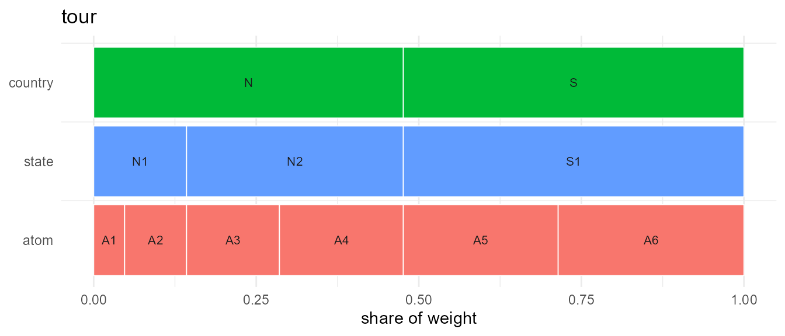
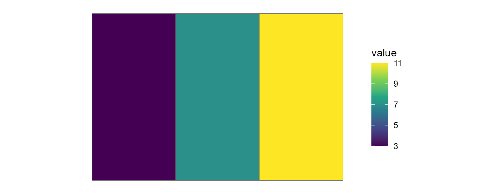
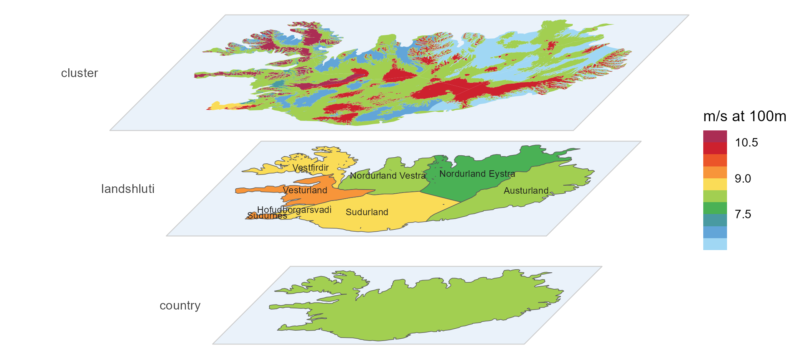

# Getting started with geoscales

## What problem does this solve?

Energy-system, climate, and policy models carve space into discrete
*regions*, and different models pick different carvings: one nation,
five grid regions, thirty-two model regions, forty-six zones. The codes
are arbitrary, the weights (area, population) are data, and region
systems drawn by different hands rarely nest — converting values between
them is where unit errors live.

`geoscales` represents any such carving as a **Geoscale**: a set of
*atoms* (the finest regions) plus ordered *geoframes* that group them —
the spatial companion to a
[`timescales::Calendar`](https://optimal2050.github.io/timescales/r/reference/Calendar.html).
With one object you get:

- a stable schema for region codes and their weights,
- well-defined conversions between any two resolutions — including
  cross-cutting ones, because every conversion routes through the atom
  layer,
- attachment of hierarchy columns to your tables, and ggplot2-ready
  maps.

## A 5-minute tour

### 1. Build a Geoscale

Three construction layers, from most to least convenient — a provider,
parent-child crosswalks, or a wide table you already have:

``` r

gs <- geoscale_from_leaftable(
  data.frame(
    country = c("N", "N", "N", "N", "S", "S"),
    state   = c("N1", "N1", "N2", "N2", "S1", "S1"),
    atom    = c("A1", "A2", "A3", "A4", "A5", "A6"),
    km2     = c(100, 200, 300, 400, 500, 600)
  ),
  geoframes = c("country", "state", "atom"),
  name = "tour"
)
gs
#> Geoscale: tour 
#> Geoframes (3, coarsest first):
#>   - country (2)
#>     - state (3)
#>       - atom (6)
#> Atoms: 6
#> Weights: km2 (default: km2)
```

([`geoscale_build()`](https://optimal2050.github.io/geoscales/r/reference/geoscale_build.md)
assembles the same thing from ragged parent-child crosswalks;
[`geoscale_from_provider()`](https://optimal2050.github.io/geoscales/r/reference/geoscale_from_provider.md)
pulls a source like Natural Earth — see
[`vignette("from-naturalearth")`](https://optimal2050.github.io/geoscales/r/articles/from-naturalearth.md).)

### 2. Inspect the structure

``` r

gs@geoframes                 # the hierarchy, coarsest first
#> [1] "country" "state"   "atom"
head(gs@leaftable, 3)        # one row per atom
#>   country state atom km2 region
#> 1       N    N1   A1 100     A1
#> 2       N    N1   A2 200     A2
#> 3       N    N2   A3 300     A3
geoscale_regions(gs, "state")
#> [1] "N1" "N2" "S1"
geoscale_share(gs, "state", weight = "km2", within = "country")
#>   state country  km2 share
#> 1    N1       N  300   0.3
#> 2    N2       N  700   0.7
#> 3    S1       S 1100   1.0
```

### 3. Convert data between resolutions

One rule per value column; aggregation and disaggregation are the same
operation, and totals conserve under `"sum"`:

``` r

cap <- tibble(atom = paste0("A", 1:6), capacity = c(1, 2, 3, 4, 5, 6))
cap |> recast_geoscale(gs, from = "atom", to = "country", rule = "sum")
#> # A tibble: 2 × 2
#>   country capacity
#>   <chr>      <dbl>
#> 1 N             10
#> 2 S             11

# ... and back down, split by area
tibble(country = c("N", "S"), capacity = c(10, 20)) |>
  recast_geoscale(gs, from = "country", to = "state",
                  rule = "sum", weight = "km2")
#> # A tibble: 3 × 2
#>   state capacity
#>   <chr>    <dbl>
#> 1 N1           3
#> 2 N2           7
#> 3 S1          20
```

The `rule` is deliberately mandatory — pass one, or register it per
column with
[`register_geo_rule()`](https://optimal2050.github.io/geoscales/r/reference/register_geo_rule.md);
a silently guessed rule would be a silent unit error.

### 4. Attach a Geoscale to a table

[`join_geoscale()`](https://optimal2050.github.io/geoscales/r/reference/join_geoscale.md)
decorates rather than converts — membership and share/weight columns
arrive `"<name>."`-prefixed, so several Geoscales can coexist on one
dataset:

``` r

tibble(state = c("N1", "N2", "S1"), v = 1:3) |>
  join_geoscale(gs, geoframes = TRUE, meta = TRUE)
#> # A tibble: 3 × 6
#>   state     v tour.country tour.weight tour.share tour 
#>   <chr> <int> <fct>              <dbl>      <dbl> <chr>
#> 1 N1        1 N                    300      0.143 N1   
#> 2 N2        2 N                    700      0.333 N2   
#> 3 S1        3 S                   1100      0.524 S1
```

### 5. Visualize

[`geoscale_autoplot()`](https://optimal2050.github.io/geoscales/r/reference/geoscale_autoplot.md)
(also [`plot()`](https://rspatial.github.io/terra/reference/plot.html))
draws the hierarchy itself — no geometry needed (and with `data =`/`z =`
its bands fill with a value recast to every geoframe — see the
visualization article):

``` r

geoscale_autoplot(gs)
```



With geometry attached (any `sfc` aligned with the atoms),
[`geom_geoscale()`](https://optimal2050.github.io/geoscales/r/reference/geom_geoscale.md)
puts values on a map inside a normal
[`ggplot()`](https://ggplot2.tidyverse.org/reference/ggplot.html)
pipeline. The data must be keyed at the geoframe you draw, so recast
finer data up first:

``` r

sq <- function(x, y) sf::st_polygon(list(cbind(
  c(x, x + 1, x + 1, x, x), c(y, y, y + 1, y + 1, y))))
gs <- attach_geometry_geoscale(gs, sf::st_sfc(
  sq(0, 1), sq(0, 0), sq(1, 1), sq(1, 0), sq(2, 1), sq(2, 0)))

cap |>
  recast_geoscale(gs, from = "atom", to = "state", rule = "sum") |>
  ggplot() +
  geom_geoscale(gs = gs, z = "capacity", geoframe = "state") +
  scale_fill_viridis_c() +
  theme_geoscale()
```



(The visualization article does the same on real maps.)

## From raster data to a Geoscale: wind clusters

The stack on the package’s front page is a real, data-built hierarchy:
Iceland’s onshore wind resource from the [Global Wind
Atlas](https://globalwindatlas.info/), clustered *within* each
administrative region into contiguous wind-speed classes. That is the
standard renewable-modeling move — a model wants a handful of supply
regions per admin unit, ranked by resource quality, not two million
raster cells.

The pipeline below is complete and pasteable (packages: sf, terra,
dplyr, [globalwindatlas](https://github.com/energyRt/globalwindatlas); a
one-time ~64 MB download plus a few minutes of geometry work). It is the
same code as `data-raw/iceland_wind.R` in the repository, which
additionally caches the slow steps and pre-saves the result. Not run
while building this page.

**Raw materials** — the wind-speed raster and the admin regions:

``` r

library(sf)     # load sf BEFORE terra -- the reverse order can crash
library(terra)  # an R session on Windows (GDAL DLL clash)
library(dplyr)

# 100 m mean wind speed for Iceland, one GeoTIFF. Pass `filename`
# explicitly -- the default filename handling mangles "data-raw"
tif <- globalwindatlas::gwa_get_wind_speed(
  "ISL", height = 100, filename = "data-raw/gwa/ISL_wind_speed_100.tif")

# onshore regions from Natural Earth; the capital region arrives split
# in two -- merge by name, and keep an ISO code per region for the
# cluster ids
ne  <- ne_source(geoframe = "states", country = "Iceland")
reg <- ne |>
  group_by(region = gn_name) |>
  summarise() |>
  st_make_valid()
iso <- ne |>
  st_drop_geometry() |>
  group_by(region = gn_name) |>
  summarise(iso = max(iso_3166_2))

# contiguous ">= 8" and ">= 10" m/s resource classes within each
# region: threshold -> polygonize -> simplify -> buffer -> drop crumbs
int <- c(0, 8, 10)
grp <- globalwindatlas::gwa_group_locations(
  tif, gis_sf = reg, ID = "region", int = int,
  aggregate_tif = 2, plot_process = FALSE)
```

**Classes to clusters** — everything in a projected CRS (ISN93 Lambert),
where the geometry ops are robust. Two boundary rules keep the later
dissolves exact (up-aggregation on the map is a *union* of atoms, and
unions only merge cleanly when shared edges match to the last
coordinate): region borders are simplified *topology-aware*
([`rmapshaper::ms_simplify()`](http://andyteucher.ca/rmapshaper/reference/ms_simplify.md)
simplifies each shared arc once —
[`sf::st_simplify()`](https://r-spatial.github.io/sf/reference/geos_unary.html)
would treat each side independently and leave sliver “ghost borders”),
and each region is carved so that every piece is differenced from the
region itself, the last class being the region’s remainder:

``` r

grp_m <- st_as_sf(grp)[, c("region", "int")] |>
  st_transform(3057) |> st_make_valid() |>
  st_simplify(dTolerance = 300) |> st_make_valid()
reg_m <- reg |>
  st_transform(3057) |> st_make_valid() |>
  rmapshaper::ms_simplify(keep = 0.2, keep_shapes = TRUE) |>
  st_make_valid()

only_poly <- function(g) {          # keep polygons, drop stray pieces
  if (length(g) == 0) return(st_sfc(st_polygon(), crs = st_crs(g)))
  g <- st_make_valid(g)
  i <- st_geometry_type(g) == "GEOMETRYCOLLECTION"
  if (any(i)) g[i] <- st_collection_extract(g[i], "POLYGON") |> st_union()
  g
}

clusters <- lapply(seq_len(nrow(reg_m)), function(i) {
  rg  <- st_geometry(reg_m)[i]
  cls <- grp_m[grp_m$region == reg_m$region[i] & grp_m$int > min(int), ]
  cls <- cls[order(-cls$int), ]
  out <- vector("list", nrow(cls) + 1L)
  acc <- NULL                       # union of the pieces cut so far
  for (k in seq_len(nrow(cls))) {
    pk <- only_poly(st_intersection(st_geometry(cls)[k], rg))
    if (!is.null(acc)) pk <- only_poly(st_difference(pk, acc))
    acc <- if (is.null(acc)) pk else only_poly(st_union(acc, pk))
    out[[k]] <- st_sf(region = reg_m$region[i], int = cls$int[k],
                      geometry = pk)
  }
  out[[nrow(cls) + 1L]] <- st_sf(region = reg_m$region[i], int = min(int),
                                 geometry = only_poly(st_difference(rg, acc)))
  do.call(rbind, out)
})

clusters <- do.call(rbind, clusters) |>
  filter(!st_is_empty(geometry),
         as.numeric(units::set_units(st_area(geometry), "km^2")) > 1) |>
  group_by(region) |>
  arrange(desc(int), .by_group = TRUE) |>
  mutate(rank = row_number()) |>   # c1 = windiest class of its region
  ungroup() |>
  left_join(iso, by = "region") |>
  mutate(cluster = paste0(iso, "_c", rank)) |>
  st_as_sf()

# per-cluster mean wind speed (from the full-resolution raster) + area
r <- rast(tif)
clusters$wind <- terra::extract(
  r, vect(st_transform(clusters, st_crs(r))),
  fun = mean, na.rm = TRUE, ID = FALSE)[[1]]
clusters$km2 <- as.numeric(units::set_units(st_area(clusters), "km^2"))
```

**Assemble the Geoscale** — the clusters are the atoms:

``` r

gs <- geoscale_from_leaftable(
  clusters |>
    st_drop_geometry() |>
    transmute(country = "Iceland", landshluti = region, cluster, km2),
  geoframes = c("country", "landshluti", "cluster"),
  key = "cluster", name = "iceland_wind"
) |>
  attach_geometry_geoscale(clusters, by = "cluster", geoframe = "cluster")

wind <- clusters |> st_drop_geometry() |> select(cluster, wind)
```

The result is an ordinary three-geoframe Geoscale — the clusters are its
atoms, so everything above applies. The repository ships it pre-built
(`data-raw/iceland_wind.rds`, written by `data-raw/iceland_wind.R`),
which is what renders here: recast the per-cluster wind speed up to the
regions with an area-weighted mean,

``` r

iceland <- readRDS("../data-raw/iceland_wind.rds")
head(iceland$gs@leaftable, 4)
#>   country       landshluti cluster       km2  region
#> 1 Iceland       Austurland IS-7_c1 5340.2458 IS-7_c1
#> 2 Iceland       Austurland IS-7_c2 8533.1805 IS-7_c2
#> 3 Iceland       Austurland IS-7_c3 7696.1286 IS-7_c3
#> 4 Iceland Hofudborgarsvadi IS-1_c1  165.8929 IS-1_c1

iceland$wind |>
  recast_geoscale(iceland$gs, from = "cluster", to = "landshluti",
                  rule = "weighted_mean", weight = "km2")
#>          landshluti     wind
#> 1        Austurland 8.694984
#> 2  Hofudborgarsvadi 9.115198
#> 3 Nordurland Eystra 8.406143
#> 4 Nordurland Vestra 8.796206
#> 5         Sudurland 9.108633
#> 6          Sudurnes 9.524734
#> 7        Vestfirdir 9.313962
#> 8        Vesturland 9.527264
```

or hand the atom-level values straight to the stack view, which recasts
them onto every plane itself (`data`/`z`) and labels a chosen geoframe
(`labels`). `palette = NULL` leaves the fill scale to the caller — here
the Global Wind Atlas palette from
[energypal](https://github.com/optimal2050/energypal), whose colours sit
on the atlas’s absolute breaks (`limits` only windows the legend);
`frame` and `connectors` draw the plane sheets and corner guides that
make the perspective legible around curved coastlines, a mostly
transparent `frame_fill` turns the sheets into glass panes, and a
per-plane `colour` vector drops the borders on the fragment-heavy
cluster plane. This is the front-page figure:

``` r

geoscale_autoplot(iceland$gs, type = "stack", view = "perspective",
                  direction = "down", data = iceland$wind, z = "wind",
                  labels = "landshluti", palette = NULL, gap = .275,
                  colour = c("grey35", "grey35", NA),  # no cluster borders
                  frame = TRUE, connectors = FALSE,
                  frame_fill = ggplot2::alpha("#6FA8DC", 0.15)) +
  energypal::scale_fill_energy_b(limits = c(6.5, 11.5)) +
  ggplot2::labs(fill = "m/s at 100m")
```



*Wind data: [Global Wind Atlas](https://globalwindatlas.info) — DTU, in
partnership with the World Bank Group, data by Vortex, funded by ESMAP.*

Offshore wind areas would slot in as a sibling branch of the same
hierarchy, but they first need a regionalization of the sea area —
deferred for now.

## Where to next?

- [Concepts](https://optimal2050.github.io/geoscales/r/articles/concepts.md)
  — atoms, partitions vs trees, the shared \*scales glossary.
- [Data
  structures](https://optimal2050.github.io/geoscales/r/articles/data-structures.md)
  — anatomy of a `Geoscale` and its registries.
- [Data
  manipulation](https://optimal2050.github.io/geoscales/r/articles/data-manipulation.md)
  — attach, recast, route halves, crosswalks, backends, and chaining
  time with space.
- [Building from Natural
  Earth](https://optimal2050.github.io/geoscales/r/articles/from-naturalearth.md)
  — providers in practice.
- [Visualization](https://optimal2050.github.io/geoscales/r/articles/visualization.md)
  — maps with
  [`geom_geoscale()`](https://optimal2050.github.io/geoscales/r/reference/geom_geoscale.md),
  on a real multi-layer example.
