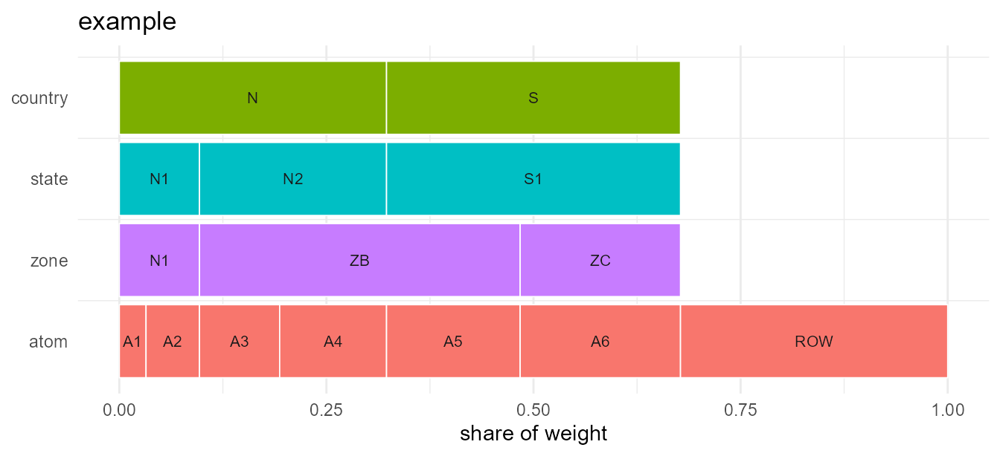

# Getting started with geoscales

``` r

library(geoscales)
```

## What a Geoscale is

A `Geoscale` is a nested spatial partition — the spatial companion to a
[`timescales::Calendar`](https://optimal2050.github.io/timescales/r/reference/Calendar.html).
It holds:

- **`leaves`** — one row per *atom* (the finest region), one column per
  level, a unique `region` key, and one or more named weight columns;
- **`levels`** — the hierarchy, ordered coarsest first;
- **`members`** — the code vocabulary at each level;
- **`meta`** — name, weights, source, CRS.

Everything else — parent/child tables, ancestry, shares — is derived on
demand. Nothing is cached on the object.

``` r

gs <- geoscale_example()
gs
#> Geoscale: example 
#> Description: Synthetic example: reused code, non-nesting level pair, and an unassigned atom 
#> Levels (4, coarsest first):
#>   - country (2)  [1 atom(s) unassigned]
#>     - state (3)  [1 atom(s) unassigned]
#>       - zone (3)  [1 atom(s) unassigned]
#>         - atom (7)
#> Atoms: 7
#> Weights: km2, pop (default: km2)
```

## Levels are partitions, not necessarily a tree

This is the main thing that differs from the time domain. Time levels
nest cleanly: every hour belongs to exactly one day. Spatial levels
frequently do not.

In the example, zone `ZB` draws atoms from two different states, so
`state` and `zone` cross-cut:

``` r

geoscale_nests(gs, "country", "state")
#> [1] TRUE
geoscale_nests(gs, "state", "zone")
#> [1] FALSE
#> attr(,"offenders")
#> [1] "ZB"
```

Real data behaves the same way. In the IDEEA region table for India, the
`reg32` code `APY` merges Andhra Pradesh with *part of* Puducherry, so
`reg35` does not nest inside `reg32`.

This is exactly why the atom layer exists, and why
[`recast_geoscale()`](https://optimal2050.github.io/geoscales/r/reference/recast_geoscale.md)
always routes through it.

## Codes are not unique across levels

The code `"N1"` exists at both `state` and `zone`. A bare code is
therefore ambiguous, and every lookup must name its level:

``` r

geoscale_children(gs, "state", "N1")
#> [1] "N1"
geoscale_children(gs, "zone", "N1")
#> [1] "A1" "A2"
```

In IDEEA, 46 of 62 codes appear at more than one level — `AN` appears at
seven. This is the norm, not an edge case.

## Recasting: one verb, both directions

[`recast_geoscale()`](https://optimal2050.github.io/geoscales/r/reference/recast_geoscale.md)
projects source values down to atoms and then aggregates them up to the
target, so aggregation and disaggregation are the same operation. The
direction falls out of the level ranks.

Going up, an extensive quantity is summed:

``` r

cap <- data.frame(atom = c("A1", "A2", "A3", "A4", "A5", "A6"),
                  capacity = c(1, 2, 3, 4, 5, 6))
recast_geoscale(cap, gs, from = "atom", to = "country", rule = "sum")
#>   country capacity
#> 1       N       10
#> 2       S       11
```

Going down, the same rule splits proportionally to a weight:

``` r

y <- data.frame(country = c("N", "S"), capacity = c(10, 20))
recast_geoscale(y, gs, from = "country", to = "state",
           rule = "sum", weight = "km2")
#>   state capacity
#> 1    N1        3
#> 2    N2        7
#> 3    S1       20
```

Totals are preserved, and a round trip is exact:

``` r

up   <- recast_geoscale(cap, gs, "atom", "state", rule = "sum")
back <- recast_geoscale(up, gs, "state", "atom", rule = "sum", weight = "km2")
back
#>   atom capacity
#> 1   A1        1
#> 2   A2        2
#> 3   A3        3
#> 4   A4        4
#> 5   A5        5
#> 6   A6        6
```

### Rules

| rule | up (coarsen) | down (refine) | use for |
|----|----|----|----|
| `sum` | sum | split by weight | capacity, demand, area |
| `weighted_mean` | weighted mean | copy | efficiency, price, capacity factor |
| `mean` | plain mean | copy | diagnostics |
| `copy` | common value | copy | region-invariant scalars |

An intensive quantity must not be summed:

``` r

eff <- data.frame(atom = c("A1", "A2", "A3", "A4", "A5", "A6"),
                  eff = c(0.3, 0.4, 0.5, 0.5, 0.6, 0.6))
recast_geoscale(eff, gs, "atom", "state", rule = "weighted_mean", weight = "pop")
#>   state  eff
#> 1    N1 0.39
#> 2    N2 0.50
#> 3    S1 0.60
```

### Registering rules per parameter

Rather than passing `rule=` at every call site, register it once. Each
value column is then converted by its own rule in a single call:

``` r

register_geo_rule("capacity", "sum")
register_geo_rule("eff", "weighted_mean", weight = "pop")

mix <- data.frame(atom = c("A1", "A2", "A3", "A4", "A5", "A6"),
                  capacity = c(1, 2, 3, 4, 5, 6),
                  eff = c(0.3, 0.4, 0.5, 0.5, 0.6, 0.6))
recast_geoscale(mix, gs, "atom", "state")
#>   state capacity  eff
#> 1    N1        3 0.39
#> 2    N2        7 0.50
#> 3    S1       11 0.60
```

An explicit `rule=` always overrides the registry.

## Partial coverage

Region tables routinely have atoms with no code at a coarser level — a
rest-of-world row, offshore zones, unassigned territory. The example has
an atom `ROW` with no country.

`na_action` decides what happens to it:

``` r

x <- rbind(cap, data.frame(atom = "ROW", capacity = 100))

# "drop" (default) loses the uncovered share, and says so
out <- suppressWarnings(
  recast_geoscale(x, gs, "atom", "country", rule = "sum"))
sum(out$capacity)
#> [1] 21

# "keep" conserves the total in an explicit NA group
kept <- recast_geoscale(x, gs, "atom", "country", rule = "sum",
                   na_action = "keep")
sum(kept$capacity)
#> [1] 121
```

Note that `energyRt` reads `NA` in a region column as *a wildcard
meaning all regions*, so `"keep"` output should not be passed there
unfiltered.

## Identifier columns

Columns that are neither the key nor a value are kept as grouping
columns, so panel data converts in one call:

``` r

panel <- data.frame(
  atom = rep(c("A1", "A2", "A3"), each = 2),
  year = rep(c(2020L, 2021L), 3),
  capacity = c(1, 2, 3, 4, 5, 6)
)
recast_geoscale(panel, gs, "atom", "state", rule = "sum", values = "capacity")
#>   state year capacity
#> 1    N1 2020        4
#> 2    N2 2020        5
#> 3    N1 2021        6
#> 4    N2 2021        6
```

## Navigating and subsetting

``` r

geoscale_regions(gs, "state")
#> [1] "N1" "N2" "S1"
geoscale_family(gs, "state", "zone")
#>   parent_level parent child_level child
#> 1        state     N1        zone    N1
#> 2        state     N2        zone    ZB
#> 3        state     S1        zone    ZB
#> 4        state     S1        zone    ZC
geoscale_descendants(gs, "country", "N")
#>   level region
#> 1 state     N1
#> 2 state     N2
#> 3  zone     N1
#> 4  zone     ZB
#> 5  atom     A1
#> 6  atom     A2
#> 7  atom     A3
#> 8  atom     A4
geoscale_share(gs, "state", weight = "km2", within = "country")
#>   state country  km2 share
#> 1    N1       N  300   0.3
#> 2    N2       N  700   0.7
#> 3    S1       S 1100   1.0
```

``` r

filter_geoscale(gs, "country", "N")
#> Geoscale: example 
#> Description: Synthetic example: reused code, non-nesting level pair, and an unassigned atom 
#> Levels (4, coarsest first):
#>   - country (1)
#>     - state (2)
#>       - zone (2)
#>         - atom (4)
#> Atoms: 4
#> Weights: km2, pop (default: km2)
gs["country", "N"]
#> Geoscale: example 
#> Description: Synthetic example: reused code, non-nesting level pair, and an unassigned atom 
#> Levels (4, coarsest first):
#>   - country (1)
#>     - state (2)
#>       - zone (2)
#>         - atom (4)
#> Atoms: 4
#> Weights: km2, pop (default: km2)
prune_geoscale(gs, "state")
#> Geoscale: example 
#> Description: Synthetic example: reused code, non-nesting level pair, and an unassigned atom 
#> Levels (2, coarsest first):
#>   - country (2)
#>     - state (3)
#> Atoms: 3
#> Weights: km2, pop (default: km2)
```

## Building a Geoscale

Three layers, from most to least convenient:

``` r

# Layer 2: from crosswalks (ragged hierarchies are the norm in space)
geoscale_build(
  data.frame(country = c("N", "N", "S"), state = c("N1", "N2", "S1")),
  data.frame(state = c("N1", "N1", "N2", "S1"),
             atom  = c("A1", "A2", "A3", "A4")),
  levels  = c("country", "state", "atom"),
  weights = data.frame(atom = c("A1", "A2", "A3", "A4"),
                       km2 = c(10, 20, 30, 40))
)
#> Geoscale: <unnamed> 
#> Levels (3, coarsest first):
#>   - country (2)
#>     - state (3)
#>       - atom (4)
#> Atoms: 4
#> Weights: km2 (default: km2)
```

``` r

# Layer 3: the escape hatch - a wide table you already have
df <- data.frame(
  country = c("C1", "C1", "C2"),
  atom    = c("A1", "A2", "A3"),
  km2     = c(100, 200, 300)
)
geoscale_from_leaves(df, levels = c("country", "atom"))
#> Geoscale: <unnamed> 
#> Levels (2, coarsest first):
#>   - country (2)
#>     - atom (3)
#> Atoms: 3
#> Weights: km2 (default: km2)
```

Layer 1 is
[`geoscale_from_provider()`](https://optimal2050.github.io/geoscales/r/reference/geoscale_from_provider.md);
see
[`vignette("from-naturalearth")`](https://optimal2050.github.io/geoscales/r/articles/from-naturalearth.md).

## Plotting

[`geoscale_autoplot()`](https://optimal2050.github.io/geoscales/r/reference/geoscale_autoplot.md)
draws the hierarchy itself as an icicle — one row per level, widths
proportional to weight. It needs no geometry.

``` r

geoscale_autoplot(gs)
```



With geometry attached via
[`attach_geometry_geoscale()`](https://optimal2050.github.io/geoscales/r/reference/attach_geometry_geoscale.md),
[`geoscale_plot()`](https://optimal2050.github.io/geoscales/r/reference/geoscale_plot.md)
draws a choropleth instead — pass a `data.frame` and name the column to
colour by.
[`geoscale_example()`](https://optimal2050.github.io/geoscales/r/reference/geoscale_example.md)
carries no geometry, so those figures need a map, and they live in the
online article [Plotting
geoscales](https://optimal2050.github.io/geoscales/r/articles/plotting.html):
choropleths by level and by value, four alternative layouts over one
hierarchy, recasting seen on the map, and where display names come from.
