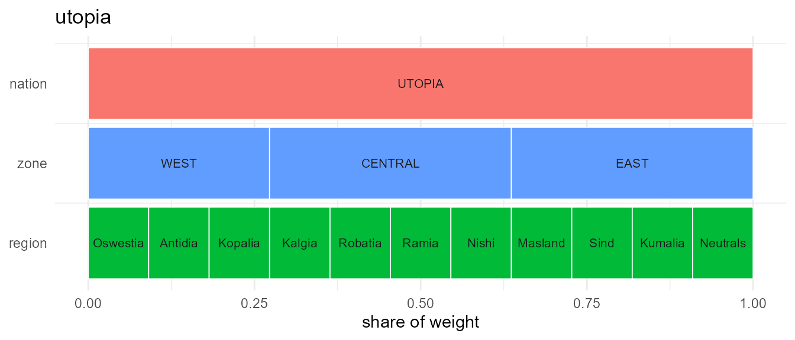
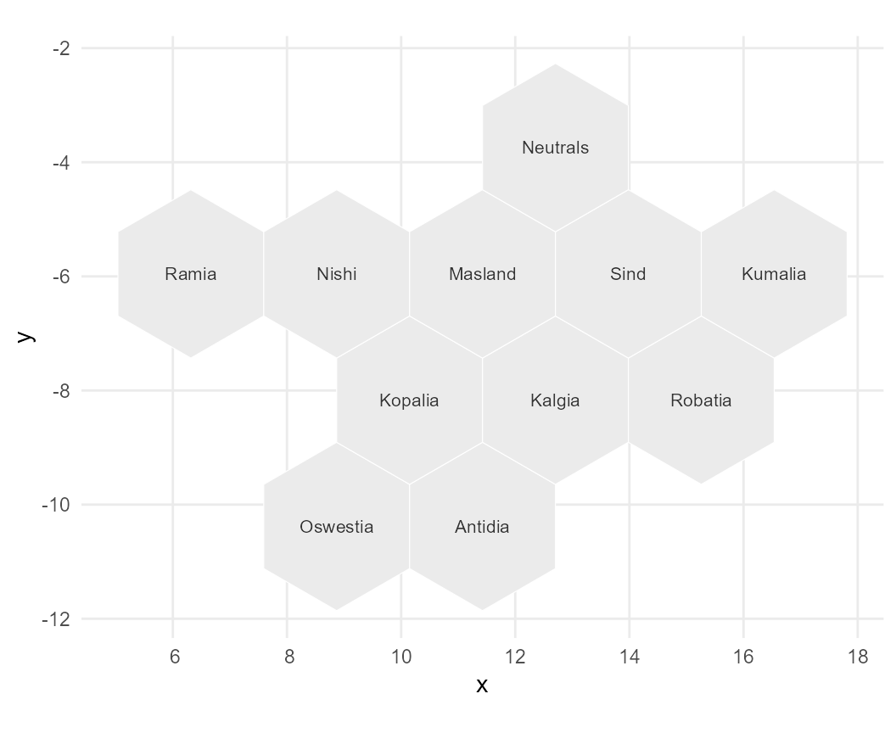
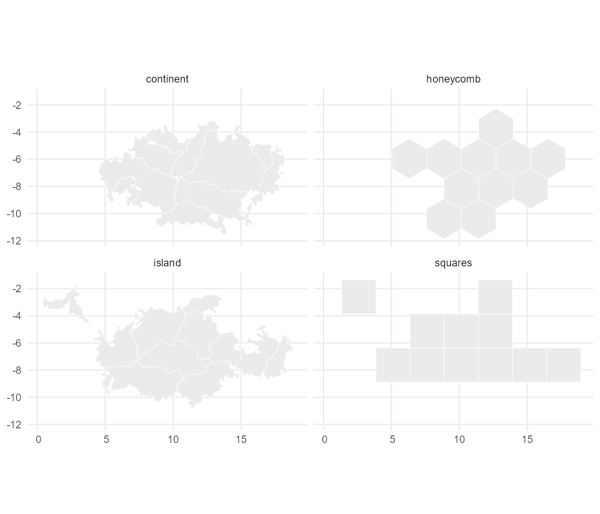
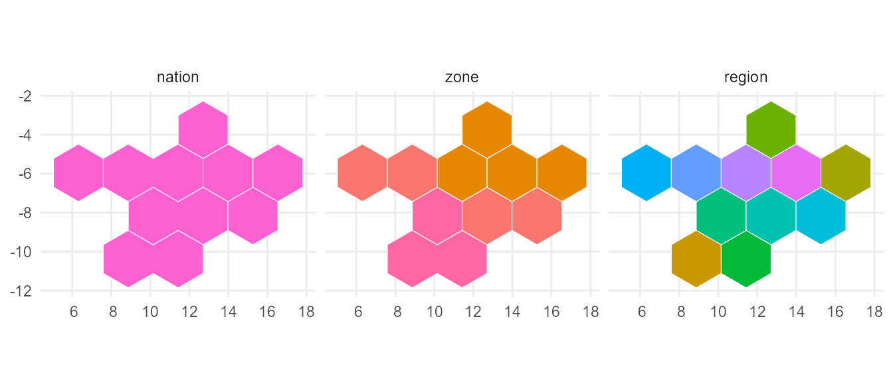
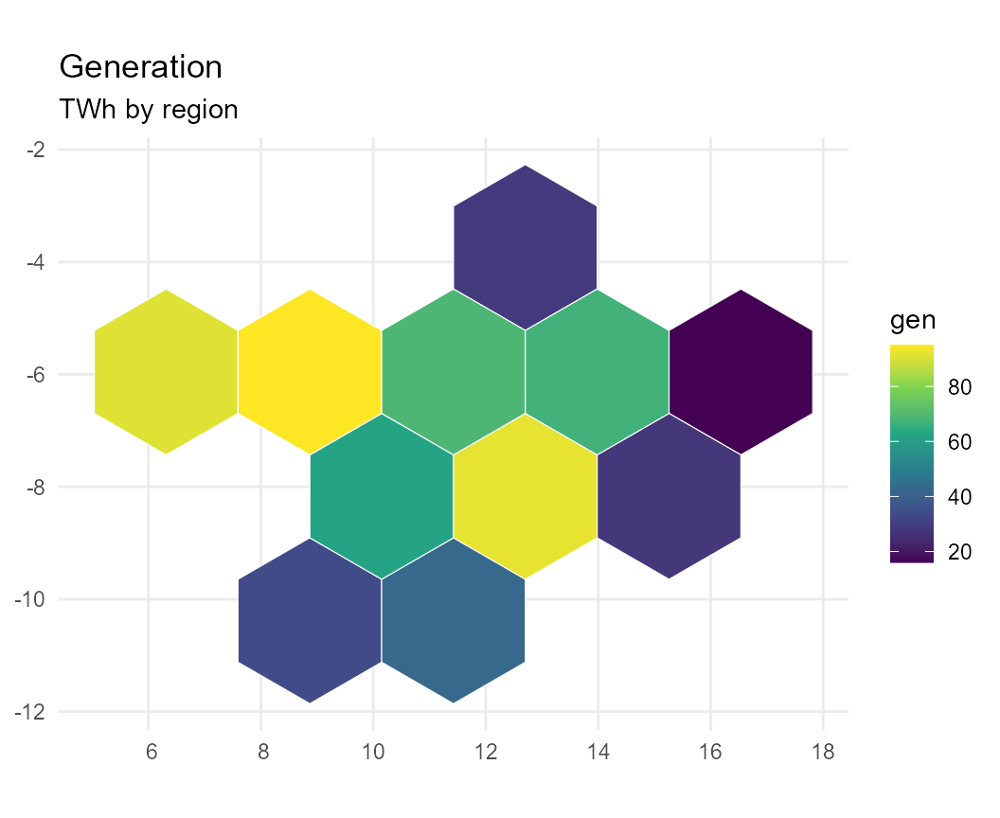
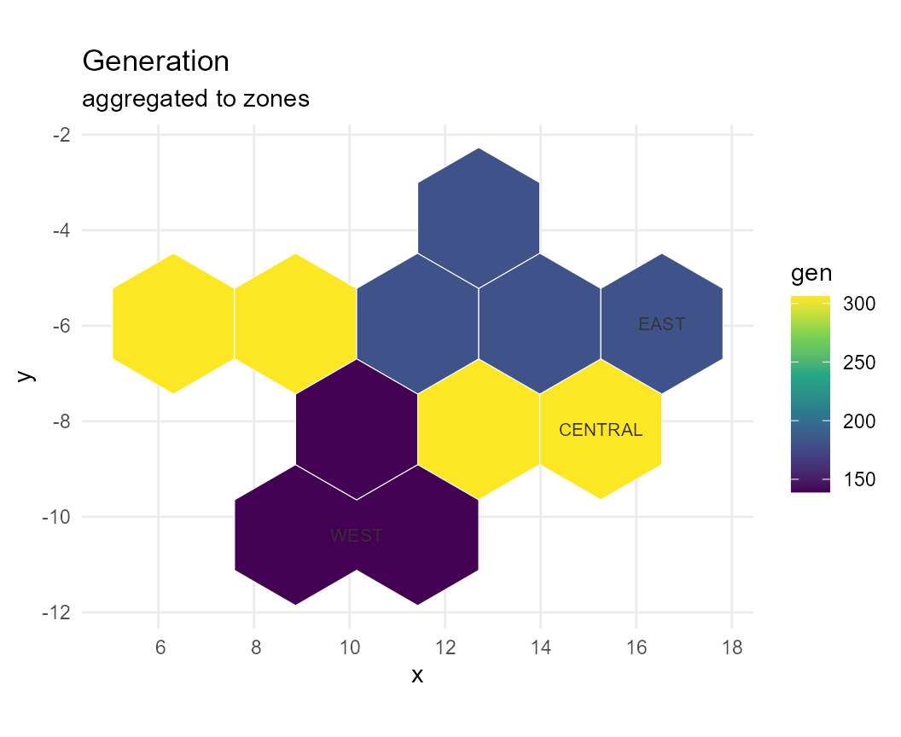
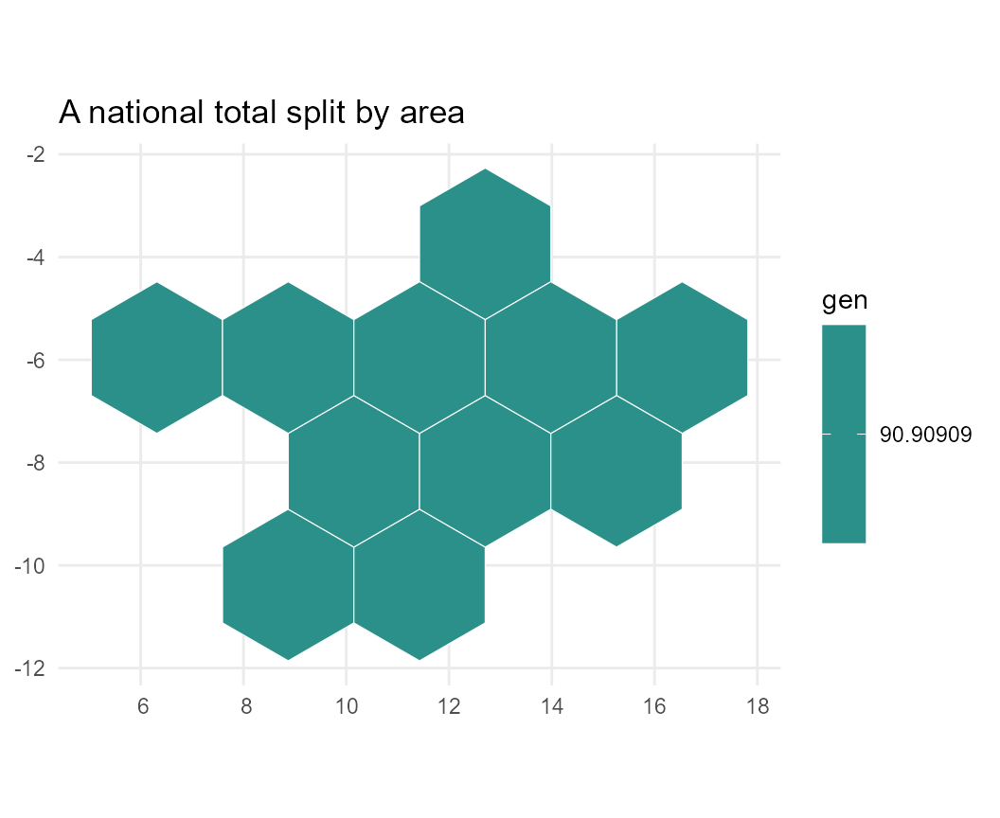
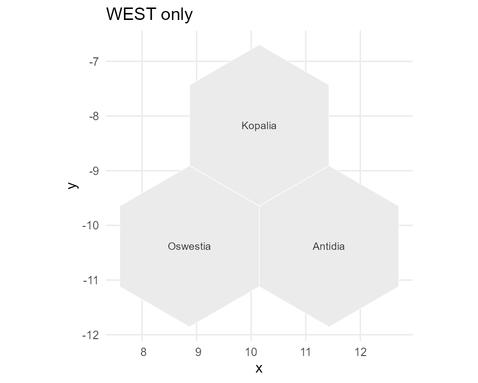

# Plotting geoscales

``` r

library(geoscales)
```

## A map to draw on

`geoscales` ships no map data, so this article borrows one. The
**UTOPIA** reference regions from `energyRt` are ideal for it: eleven
regions nested `nation -> zone -> region`, entirely offline, and
completely invented — so nothing here depends on a network, a licence,
or any real-world boundary.

``` r

gs <- energyRt::utopia_geoscale("honeycomb")
#> Warning in geoscales::geo_attach_geometry(gs, utopia$map[[layout]], by = "region", : 'geo_attach_geometry' is deprecated.
#> Use 'attach_geometry_geoscale' instead.
#> See help("Deprecated")
#> Warning in geoscales::geo_area(gs, name = "area"): 'geo_area' is deprecated.
#> Use 'add_area_geoscale' instead.
#> See help("Deprecated")
gs
#> Geoscale: utopia 
#> Description: UTOPIA reference regions, nested nation -> zone -> region 
#> Levels (3, coarsest first):
#>   - nation (1)
#>     - zone (3)
#>       - region (11)
#> Atoms: 11
#> Weights: area (default: area)
#> CRS: NA
#> Geometry: attached (11 features)
```

That one call returns a finished `Geoscale`: hierarchy, geometry and an
`area` weight. Everything from here on is plain `geoscales`.

``` r

head(as.data.frame(S7::prop(gs, "leaves")), 4)
#>   nation    zone region     name     area
#> 1 UTOPIA    WEST     R1 Oswestia 5.655895
#> 2 UTOPIA    WEST     R2  Antidia 5.655895
#> 3 UTOPIA    WEST     R3  Kopalia 5.655895
#> 4 UTOPIA CENTRAL     R4   Kalgia 5.655895
```

## Two views of the same object

A `Geoscale` is a hierarchy that *may* carry geometry, and the two are
drawn by different functions.
[`geo_autoplot()`](https://optimal2050.github.io/geoscales/r/reference/geoscales-deprecated.md)
shows the **structure** — one row per level, widths proportional to
weight — and needs no geometry at all:

``` r

geo_autoplot(gs)
#> Warning in geo_autoplot(gs): 'geo_autoplot' is deprecated.
#> Use 'geoscale_autoplot' instead.
#> See help("Deprecated")
```



[`geo_plot()`](https://optimal2050.github.io/geoscales/r/reference/geoscales-deprecated.md)
shows the same regions in **space**:

``` r

geo_plot(gs, label = TRUE)
#> Warning in geo_plot(gs, label = TRUE): 'geo_plot' is deprecated.
#> Use 'geoscale_plot' instead.
#> See help("Deprecated")
```



Note the labels. The icicle above says `WEST`, `CENTRAL`, `EAST` but the
map says *Oswestia*, *Antidia*, …: a geoscale can declare a column of
display names (`labels = "name"` here), and they are used wherever they
are unambiguous. A zone made of Oswestia and Antidia has no name of its
own, so it keeps its code rather than borrowing one of its parts.

## Geometry is separable from hierarchy

UTOPIA ships four alternative layouts. The hierarchy is identical in all
of them — only the shapes differ, which is exactly the point: a
`Geoscale` is a nesting first and a map second.

[`geo_geometry()`](https://optimal2050.github.io/geoscales/r/reference/geoscales-deprecated.md)
returns an ordinary `sf` object, so combining the layouts into one
faceted figure needs nothing from this package:

``` r

layouts <- c("squares", "honeycomb", "island", "continent")

shapes <- do.call(rbind, lapply(layouts, function(l) {
  s <- geo_geometry(energyRt::utopia_geoscale(l), level = "region")
  s$layout <- l
  s
}))
#> Warning in geo_geometry(energyRt::utopia_geoscale(l), level = "region"): 'geo_geometry' is deprecated.
#> Use 'geoscale_geometry' instead.
#> See help("Deprecated")
#> Warning in geoscales::geo_attach_geometry(gs, utopia$map[[layout]], by = "region", : 'geo_attach_geometry' is deprecated.
#> Use 'attach_geometry_geoscale' instead.
#> See help("Deprecated")
#> Warning in geoscales::geo_area(gs, name = "area"): 'geo_area' is deprecated.
#> Use 'add_area_geoscale' instead.
#> See help("Deprecated")
#> Warning in geo_geometry(energyRt::utopia_geoscale(l), level = "region"): 'geo_geometry' is deprecated.
#> Use 'geoscale_geometry' instead.
#> See help("Deprecated")
#> Warning in geoscales::geo_attach_geometry(gs, utopia$map[[layout]], by = "region", : 'geo_attach_geometry' is deprecated.
#> Use 'attach_geometry_geoscale' instead.
#> See help("Deprecated")
#> Warning in geoscales::geo_area(gs, name = "area"): 'geo_area' is deprecated.
#> Use 'add_area_geoscale' instead.
#> See help("Deprecated")
#> Warning in geo_geometry(energyRt::utopia_geoscale(l), level = "region"): 'geo_geometry' is deprecated.
#> Use 'geoscale_geometry' instead.
#> See help("Deprecated")
#> Warning in geoscales::geo_attach_geometry(gs, utopia$map[[layout]], by = "region", : 'geo_attach_geometry' is deprecated.
#> Use 'attach_geometry_geoscale' instead.
#> See help("Deprecated")
#> Warning in geoscales::geo_area(gs, name = "area"): 'geo_area' is deprecated.
#> Use 'add_area_geoscale' instead.
#> See help("Deprecated")
#> Warning in geo_geometry(energyRt::utopia_geoscale(l), level = "region"): 'geo_geometry' is deprecated.
#> Use 'geoscale_geometry' instead.
#> See help("Deprecated")
#> Warning in geoscales::geo_attach_geometry(gs, utopia$map[[layout]], by = "region", : 'geo_attach_geometry' is deprecated.
#> Use 'attach_geometry_geoscale' instead.
#> See help("Deprecated")
#> Warning in geoscales::geo_area(gs, name = "area"): 'geo_area' is deprecated.
#> Use 'add_area_geoscale' instead.
#> See help("Deprecated")

ggplot2::ggplot(shapes) +
  ggplot2::geom_sf(fill = "grey92", colour = "white") +
  ggplot2::facet_wrap(~layout) +
  ggplot2::theme_minimal()
```



## One level per panel

`geo_plot(level = )` dissolves the atoms up to whichever level you ask
for. Eleven regions become three zones become one nation:

``` r

levels_sf <- do.call(rbind, lapply(geo_levels(gs), function(l) {
  s <- geo_geometry(gs, level = l)
  names(s)[1] <- "code"
  s$level <- l
  s
}))
#> Warning in geo_levels(gs): 'geo_levels' is deprecated.
#> Use 'geoscale_levels' instead.
#> See help("Deprecated")
#> Warning in geo_geometry(gs, level = l): 'geo_geometry' is deprecated.
#> Use 'geoscale_geometry' instead.
#> See help("Deprecated")
#> Warning in geo_geometry(gs, level = l): 'geo_geometry' is deprecated.
#> Use 'geoscale_geometry' instead.
#> See help("Deprecated")
#> Warning in geo_geometry(gs, level = l): 'geo_geometry' is deprecated.
#> Use 'geoscale_geometry' instead.
#> See help("Deprecated")
levels_sf$level <- factor(levels_sf$level, levels = geo_levels(gs))
#> Warning in geo_levels(gs): 'geo_levels' is deprecated.
#> Use 'geoscale_levels' instead.
#> See help("Deprecated")

ggplot2::ggplot(levels_sf) +
  ggplot2::geom_sf(ggplot2::aes(fill = code), colour = "white",
                   show.legend = FALSE) +
  ggplot2::facet_wrap(~level) +
  ggplot2::theme_minimal()
```



## Values on the map

Pass a `data.frame` with a column named after the level, and name the
column to colour by:

``` r

set.seed(1)
gen <- data.frame(region = geo_regions(gs, "region"),
                  gen = round(runif(11, 10, 100)))
#> Warning in geo_regions(gs, "region"): 'geo_regions' is deprecated.
#> Use 'geoscale_regions' instead.
#> See help("Deprecated")

geo_plot(gs, gen, level = "region", fill = "gen",
         palette = "D", title = "Generation", subtitle = "TWh by region")
#> Warning in geo_plot(gs, gen, level = "region", fill = "gen", palette = "D", : 'geo_plot' is deprecated.
#> Use 'geoscale_plot' instead.
#> See help("Deprecated")
```



[`geo_plot()`](https://optimal2050.github.io/geoscales/r/reference/geoscales-deprecated.md)
is the package’s only choropleth renderer, and it is deliberately
ignorant of what your numbers mean. Callers that *do* know —
`energyRt::geo_map()` is one — prepare the `data.frame` and hand it here
rather than drawing their own `geom_sf()`.

## Recasting, seen on the map

[`geo_recast()`](https://optimal2050.github.io/geoscales/r/reference/geoscales-deprecated.md)
is the one verb that moves data between levels, in both directions.
Aggregating eleven regions into three zones with `rule = "sum"`:

``` r

by_zone <- geo_recast(gen, gs, from = "region", to = "zone", rule = "sum")
#> Warning in geo_recast(gen, gs, from = "region", to = "zone", rule = "sum"): 'geo_recast' is deprecated.
#> Use 'recast_geoscale' instead.
#> See help("Deprecated")
by_zone
#>      zone gen
#> 1 CENTRAL 306
#> 2    EAST 181
#> 3    WEST 139
sum(by_zone$gen) == sum(gen$gen)
#> [1] TRUE
```

``` r

geo_plot(gs, by_zone, level = "zone", fill = "gen",
         palette = "D", title = "Generation", subtitle = "aggregated to zones",
         label = TRUE)
#> Warning in geo_plot(gs, by_zone, level = "zone", fill = "gen", palette = "D", : 'geo_plot' is deprecated.
#> Use 'geoscale_plot' instead.
#> See help("Deprecated")
```



The same verb runs back down. Going down, `rule = "sum"` splits each
total in proportion to a weight, so the national figure is conserved:

``` r

national <- data.frame(nation = "UTOPIA", gen = 1000)
split_back <- geo_recast(national, gs, from = "nation", to = "region",
                         rule = "sum", weight = "area")
#> Warning in geo_recast(national, gs, from = "nation", to = "region", rule = "sum", : 'geo_recast' is deprecated.
#> Use 'recast_geoscale' instead.
#> See help("Deprecated")

geo_plot(gs, split_back, level = "region", fill = "gen", palette = "D",
         title = "A national total split by area")
#> Warning in geo_plot(gs, split_back, level = "region", fill = "gen", palette = "D", : 'geo_plot' is deprecated.
#> Use 'geoscale_plot' instead.
#> See help("Deprecated")
```



## Extensive and intensive quantities

The rule matters, and the map makes the difference obvious. Generation
**adds up** — it is extensive, so `sum` is right. A capacity factor does
not: averaging it needs a weight, and summing it is meaningless.

``` r

cf <- data.frame(region = geo_regions(gs, "region"),
                 cf = round(runif(11, 0.2, 0.6), 2))
#> Warning in geo_regions(gs, "region"): 'geo_regions' is deprecated.
#> Use 'geoscale_regions' instead.
#> See help("Deprecated")

right <- geo_recast(cf, gs, "region", "zone", rule = "weighted_mean",
                    weight = "area")
#> Warning in geo_recast(cf, gs, "region", "zone", rule = "weighted_mean", : 'geo_recast' is deprecated.
#> Use 'recast_geoscale' instead.
#> See help("Deprecated")
wrong <- geo_recast(cf, gs, "region", "zone", rule = "sum")
#> Warning in geo_recast(cf, gs, "region", "zone", rule = "sum"): 'geo_recast' is deprecated.
#> Use 'recast_geoscale' instead.
#> See help("Deprecated")
merge(right, wrong, by = "zone", suffixes = c("_weighted_mean", "_sum"))
#>      zone cf_weighted_mean cf_sum
#> 1 CENTRAL        0.5000000   2.00
#> 2    EAST        0.4275000   1.71
#> 3    WEST        0.3633333   1.09
```

Every value in the `sum` column is above 1.0, and a capacity factor
above 1.0 is not a number that exists. The weighted mean stays in range
because it asks *how much* of each region there is; the sum does not.
Register the rule once per parameter and it cannot be got wrong twice —
see
[`vignette("geoscales")`](https://optimal2050.github.io/geoscales/r/articles/geoscales.md).

## Subsetting

[`geo_filter()`](https://optimal2050.github.io/geoscales/r/reference/geoscales-deprecated.md)
returns a smaller `Geoscale`, geometry included, so it plots like any
other:

``` r

west <- geo_filter(gs, level = "zone", region = "WEST")
#> Warning in geo_filter(gs, level = "zone", region = "WEST"): 'geo_filter' is deprecated.
#> Use 'filter_geoscale' instead.
#> See help("Deprecated")
geo_plot(west, label = TRUE, title = "WEST only")
#> Warning in geo_plot(west, label = TRUE, title = "WEST only"): 'geo_plot' is deprecated.
#> Use 'geoscale_plot' instead.
#> See help("Deprecated")
```



## Bringing your own source

UTOPIA arrived here as a plain function call, but any source can be
registered with the provider interface that `rnaturalearth` uses — see
[`vignette("from-naturalearth")`](https://optimal2050.github.io/geoscales/r/articles/from-naturalearth.md):

``` r

geo_register_provider(
  "utopia",
  fetch = function(layout = "honeycomb") {
    merge(energyRt::utopia$geo, energyRt::utopia$map[[layout]], by = "region")
  },
  levels = c("nation", "zone", "region"),
  desc = "UTOPIA reference regions (energyRt)"
)
geoscale_from_provider("utopia")
```

## See also

- [`vignette("geoscales")`](https://optimal2050.github.io/geoscales/r/articles/geoscales.md)
  — what a Geoscale is, and the recasting rules
- [`vignette("from-naturalearth")`](https://optimal2050.github.io/geoscales/r/articles/from-naturalearth.md)
  — building one from real boundary data
