# Visualization with ggplot2

## The viz surface at a glance

| kind | functions | use when |
|----|----|----|
| composable layers | [`geom_geoscale()`](https://optimal2050.github.io/geoscales/r/reference/geom_geoscale.md), [`theme_geoscale()`](https://optimal2050.github.io/geoscales/r/reference/geom_geoscale.md) | you are building your own [`ggplot()`](https://ggplot2.tidyverse.org/reference/ggplot.html) and want a choropleth as one layer among others |
| assembled figures | [`geoscale_autoplot()`](https://optimal2050.github.io/geoscales/r/reference/geoscale_autoplot.md) (structure icicle; also [`plot()`](https://rspatial.github.io/terra/reference/plot.html)), [`geoscale_plot()`](https://optimal2050.github.io/geoscales/r/reference/geoscale_plot.md) (one-call choropleth) | you want a finished figure in one call |
| layout / geometry workers | [`geoscale_layout()`](https://optimal2050.github.io/geoscales/r/reference/geoscale_layout.md), [`geoscale_geometry()`](https://optimal2050.github.io/geoscales/r/reference/geoscale_geometry.md) | you want the plain frames behind the figures |

This article needs maps, so it runs on two fixtures that stay out of the
package by design (geoscales ships integration code, not data): the
offline
[`energyRt::utopia_geoscale()`](https://energyRt.org/reference/utopia_geoscale.html)
reference layout, and — for the real-world tour — Iceland from Natural
Earth’s admin-1 layer.

## The integration contract

[`geom_geoscale()`](https://optimal2050.github.io/geoscales/r/reference/geom_geoscale.md)
mirrors the design of
[`timescales::geom_calendar()`](https://optimal2050.github.io/timescales/r/reference/geom_calendar.html):
the geoscale inputs are column **names** (`z=`, `region=`), not
[`aes()`](https://ggplot2.tidyverse.org/reference/aes.html) mappings,
and each call returns a standard
[`ggplot2::geom_sf()`](https://ggplot2.tidyverse.org/reference/ggsf.html)
layer whose data is derived from the plot data — the object’s geometry
is dissolved at the requested `geoframe` (via
[`geoscale_geometry()`](https://optimal2050.github.io/geoscales/r/reference/geoscale_geometry.md)),
the value column is aggregated per region with `fun`, and everything
else — scales, facets, themes, extra layers — composes through the
normal ggplot2 path.

## Choropleths, composably

``` r

gs <- energyRt::utopia_geoscale("honeycomb")
gs
#> Geoscale: utopia 
#> Description: UTOPIA reference regions, nested nation -> zone -> region 
#> Geoframes (3, coarsest first):
#>   - nation (1)
#>     - zone (3)
#>       - region (11)
#> Atoms: 11
#> Weights: area (default: area)
#> CRS: NA
#> Geometry: attached (11 features)

x <- tibble(region = geoscale_regions(gs, "region"),
            capacity = c(5, 3, 8, 2, 6, 4, 7, 1, 9, 2, 5))

ggplot(x) +
  geom_geoscale(gs = gs, z = "capacity", geoframe = "region") +
  scale_fill_viridis_c(option = "G") +
  labs(title = "Capacity by region", fill = "GW") +
  theme_geoscale()
```

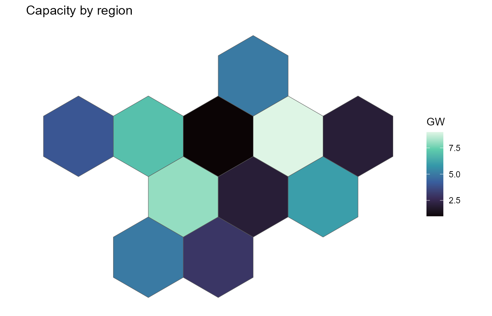

With `z = NULL` the layer draws plain boundaries — useful under other
layers:

``` r

ggplot() +
  geom_geoscale(gs = gs, colour = "grey40", fill = "grey93") +
  theme_geoscale()
```

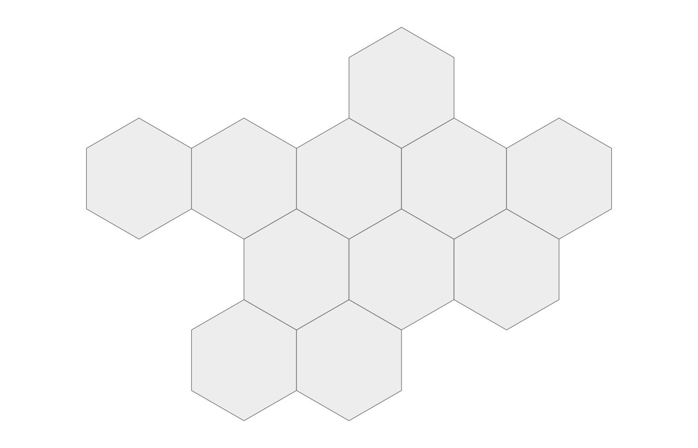

## Recasting, seen on the map

The same data drawn at another geoframe is one `geoframe=` away — the
layer dissolves and aggregates for you (here with `fun = sum` for an
extensive quantity):

``` r

ggplot(x) +
  geom_geoscale(gs = gs, z = "capacity", geoframe = "zone", fun = sum) +
  scale_fill_viridis_c(option = "G") +
  labs(title = "The same capacity, by zone", fill = "GW") +
  theme_geoscale()
```

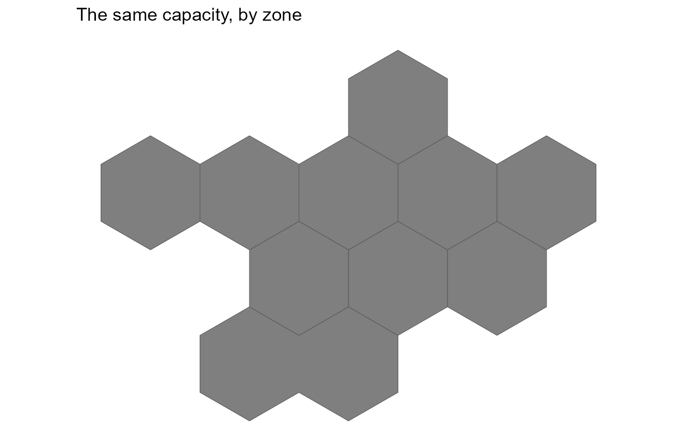

For full control,
[`recast_geoscale()`](https://optimal2050.github.io/geoscales/r/reference/recast_geoscale.md)
first and draw the result — the explicit route makes the rule visible
(and lets intensive quantities use `weighted_mean`):

``` r

x |>
  recast_geoscale(gs, from = "region", to = "zone", rule = "sum") |>
  ggplot() +
  geom_geoscale(gs = gs, z = "capacity", geoframe = "zone") +
  scale_fill_viridis_c(option = "G") +
  theme_geoscale()
```

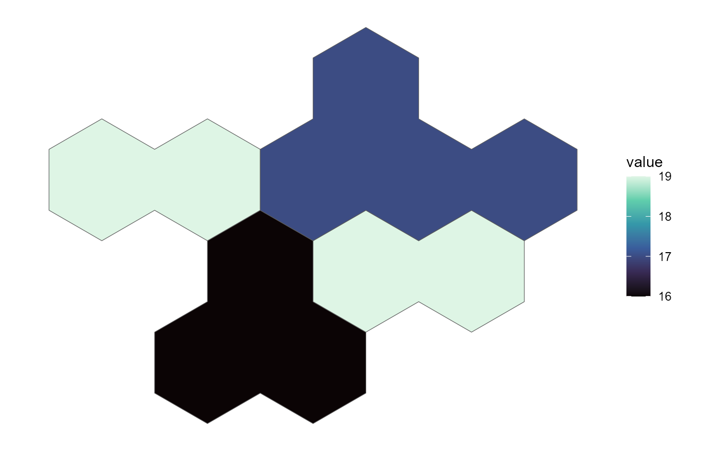

## One panel per geoframe

Dissolved shapes are plain sf objects, so faceting a hierarchy is a
small `|>` chain over
[`geoscale_geometry()`](https://optimal2050.github.io/geoscales/r/reference/geoscale_geometry.md):

``` r

shapes <- geoscale_geoframes(gs) |>
  lapply(function(gf) {
    geoscale_geometry(gs, gf) |>
      sf::st_sf() |>
      mutate(geoframe = gf, .before = 1) |>
      rename(code = 2)
  }) |>
  bind_rows() |>
  mutate(geoframe = factor(geoframe, levels = geoscale_geoframes(gs)))

ggplot(shapes) +
  geom_sf(aes(fill = code), show.legend = FALSE) +
  facet_wrap(~geoframe) +
  scale_fill_viridis_d(option = "G") +
  theme_geoscale()
```

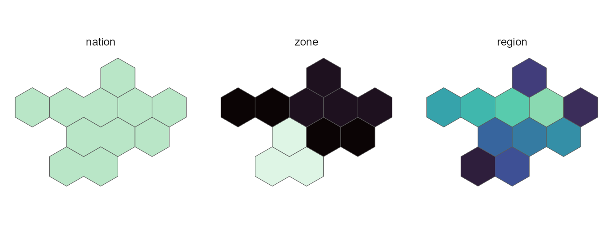

## Structure figures

The assembled counterparts need no geometry at all.
[`geoscale_autoplot()`](https://optimal2050.github.io/geoscales/r/reference/geoscale_autoplot.md)
(also [`plot()`](https://rspatial.github.io/terra/reference/plot.html))
draws the hierarchy as an icicle; its plain-data frame is
[`geoscale_layout()`](https://optimal2050.github.io/geoscales/r/reference/geoscale_layout.md):

``` r

plot(gs)
```

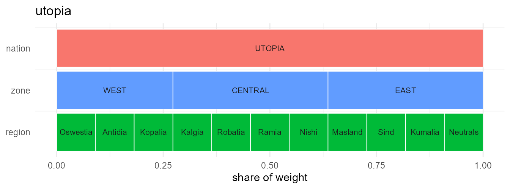

``` r

head(geoscale_layout(gs), 4)
#>   geoframe  region rank      xmin      xmax ymin ymax   weight     share
#> 1   nation  UTOPIA    1 0.0000000 1.0000000    2  2.9 62.21484 1.0000000
#> 2     zone    WEST    2 0.0000000 0.2727273    1  1.9 16.96768 0.2727273
#> 3     zone CENTRAL    2 0.2727273 0.6363636    1  1.9 22.62358 0.3636364
#> 4     zone    EAST    2 0.6363636 1.0000000    1  1.9 22.62358 0.3636364
```

The icicle carries data too — `data =`/`z =` fill every band with the
value recast to that geoframe (atoms keep their own values, coarser
bands get the weighted mean):

``` r

cap <- data.frame(region = geoscale_regions(gs, "region"),
                  mw = c(40, 15, 75, 30, 60, 22, 8, 55, 34, 12, 48))
geoscale_autoplot(gs, data = cap, z = "mw", label = TRUE) +
  labs(fill = "MW")
```

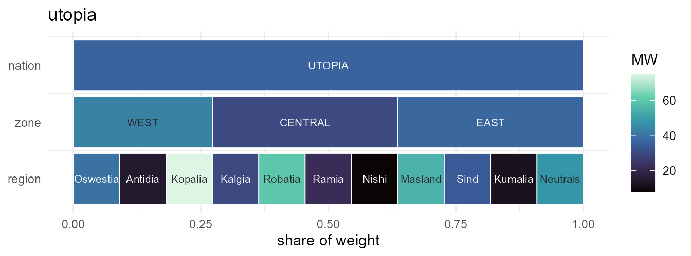

With geometry attached, `type = "stack"` draws the layer-stack view —
the same atoms dissolved at every geoframe, stacked:

``` r

geoscale_autoplot(gs, type = "stack")
```

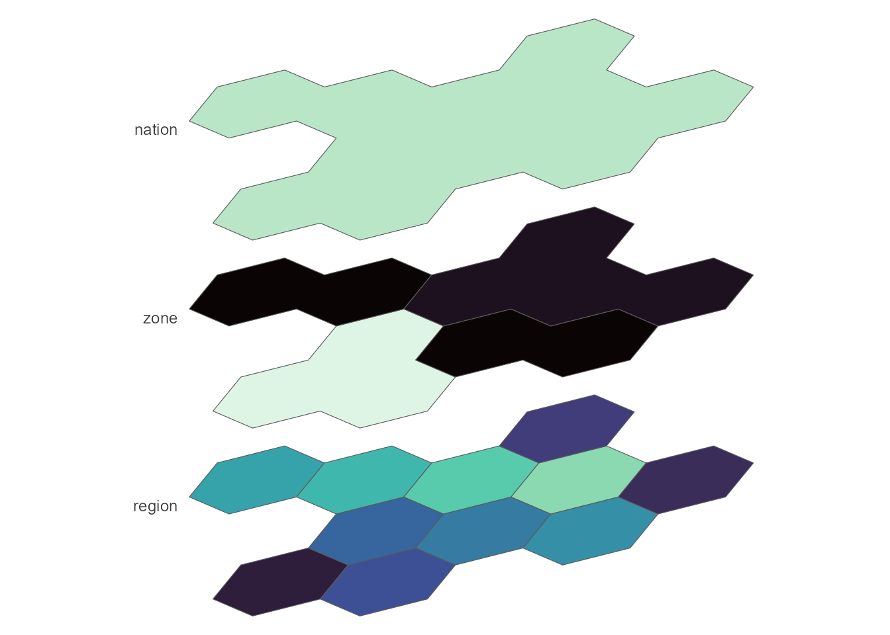

### Points of view

The stack takes a `view` preset — from flat `"top-down"` through the
oblique family (`"cavalier"`, `"cabinet"`) and the axonometric family
(`"military"`, `"isometric"`, `"dimetric"`, `"trimetric"`) to
`"perspective"`, where receding planes shrink. Custom obliques come via
`angle`/`ratio`, `rotate=` turns the plane (point North anywhere),
`direction=` flips the stack, and `gap` defaults to planes almost
touching:

``` r

# grouped by aspect so tall and flat views don't squeeze each other
views <- c("top-down", "military", "isometric",
           "dimetric", "trimetric", "cabinet",
           "oblique", "cavalier", "perspective")
views |>
  lapply(function(vw)
    geoscale_autoplot(gs, type = "stack", view = vw) +
      labs(title = vw) +
      theme(plot.title = element_text(size = 9, hjust = 0.5))) |>
  patchwork::wrap_plots(ncol = 3)
```

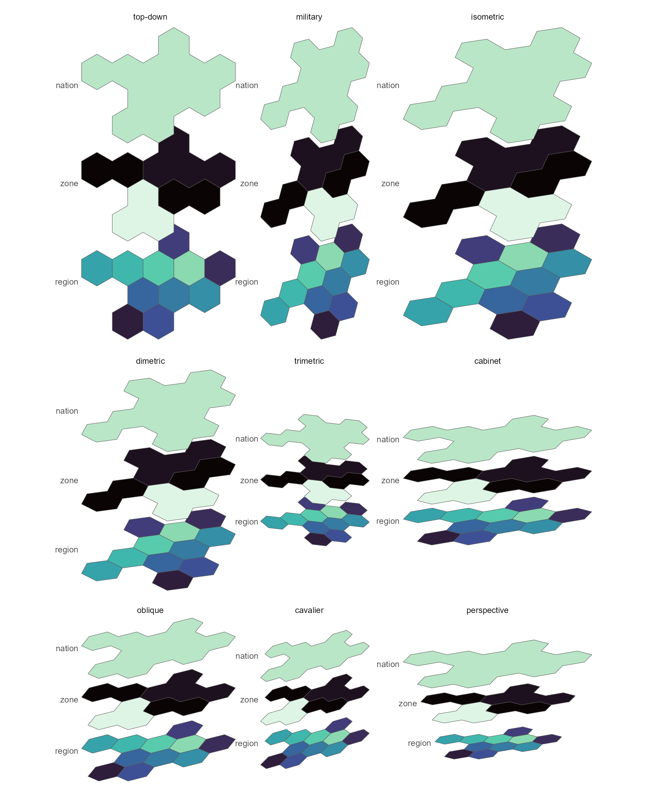

And
[`geoscale_plot()`](https://optimal2050.github.io/geoscales/r/reference/geoscale_plot.md)
is the one-call choropleth over the same machinery:

``` r

geoscale_plot(gs, x, geoframe = "region", fill = "capacity",
              palette = "G")
```

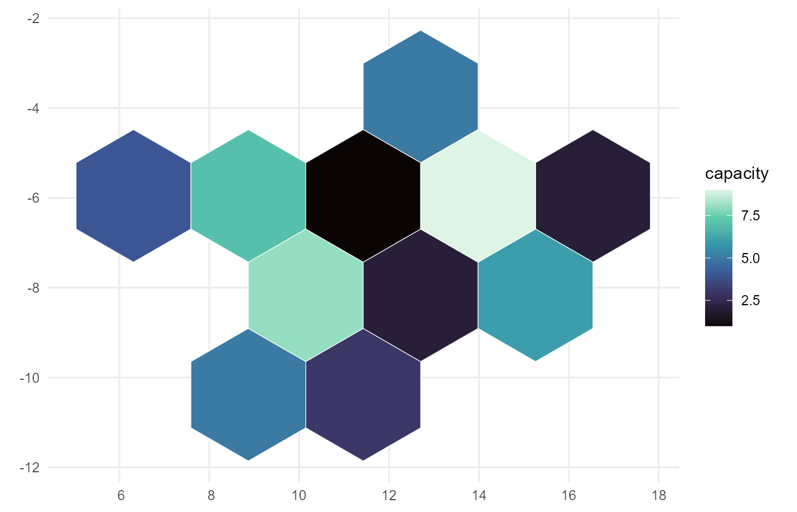

## A real map: Iceland, with data attached

The same workflow on real boundaries. Natural Earth’s admin-1 layer
gives nine units for Iceland that group into its eight regions
(*landshluti*) — a genuinely **ragged** hierarchy, because Reykjavik and
the surrounding capital area are separate features of one region:

``` r

s <- ne_source(geoframe = "states", country = "Iceland")
d <- as.data.frame(s)

isl <- geoscale_from_leaftable(
  data.frame(country    = "ISL",
             landshluti = d$gn_name,
             unit       = d$iso_3166_2),
  geoframes = c("country", "landshluti", "unit"),
  key = "unit", name = "iceland"
) |>
  attach_geometry_geoscale(s, by = "iso_3166_2", geoframe = "unit") |>
  add_area_geoscale(name = "km2")
isl
#> Geoscale: iceland 
#> Geoframes (3, coarsest first):
#>   - country (1)
#>     - landshluti (8)
#>       - unit (9)
#> Atoms: 9
#> Weights: km2 (default: km2)
#> CRS: WGS 84
#> Geometry: attached (9 features)
```

[`add_area_geoscale()`](https://optimal2050.github.io/geoscales/r/reference/add_area_geoscale.md)
just attached real data — equal-area km² per unit — which is also the
object’s default weight. Drawn straight from the leaftable:

``` r

lt <- geoscale_leaftable(isl)

ggplot(tibble(unit = lt$region, km2 = lt$km2)) +
  geom_geoscale(gs = isl, z = "km2", geoframe = "unit",
                colour = "white", linewidth = 0.3) +
  scale_fill_viridis_c(option = "G", trans = "sqrt") +
  labs(title = "Iceland's nine Natural Earth units, by area",
       fill = "km2") +
  theme_geoscale()
```

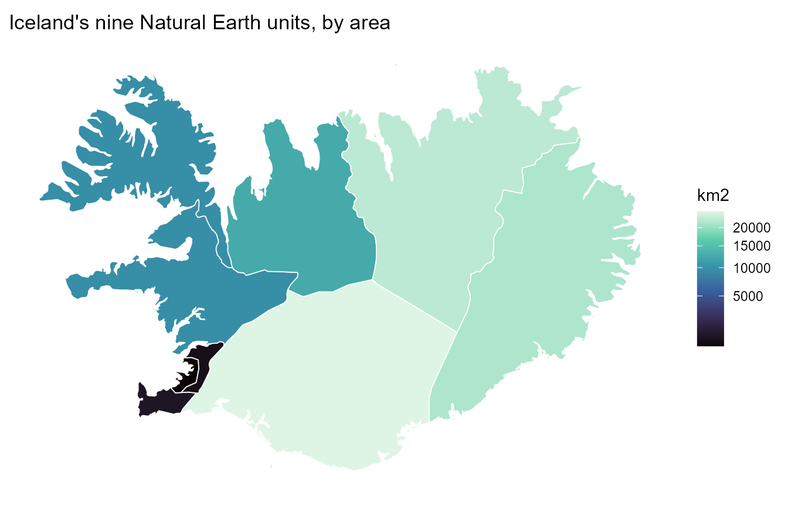

And the full loop in one pipeline: a national total split down to the
regions by area (`rule = "sum"` conserves it), drawn at the *landshluti*
geoframe — where the two capital-area units render as one region:

``` r

tibble(country = "ISL", capacity_mw = 3000) |>
  recast_geoscale(isl, from = "country", to = "landshluti",
                  rule = "sum", weight = "km2") |>
  ggplot() +
  geom_geoscale(gs = isl, z = "capacity_mw", geoframe = "landshluti",
                colour = "white", linewidth = 0.3) +
  scale_fill_viridis_c(option = "G") +
  labs(title = "A 3 GW national total, split by area across 8 regions",
       fill = "MW") +
  theme_geoscale()
```

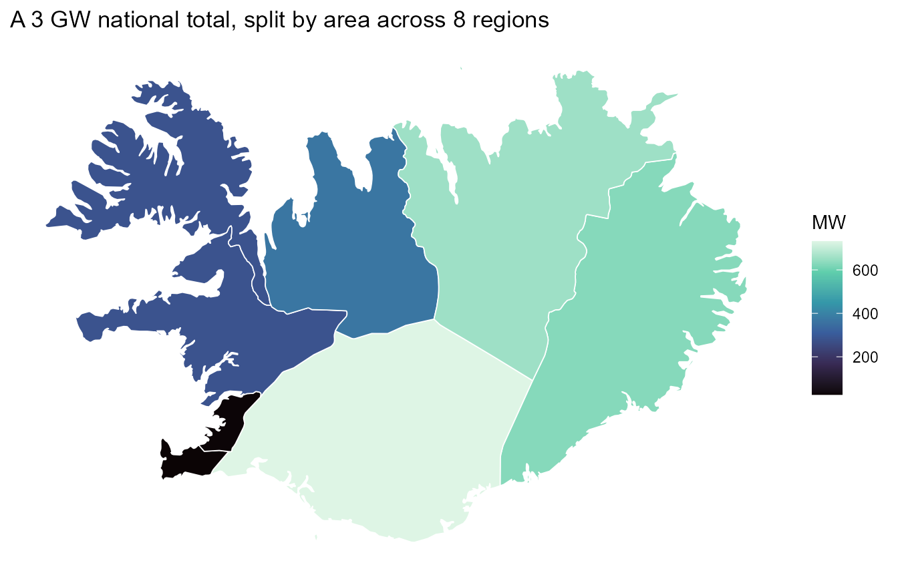

## One resource, three geoframes

Model design is choosing a resolution. The wind-cluster Geoscale from
the [get-started
vignette](https://optimal2050.github.io/geoscales/r/articles/geoscales.html)
carries Iceland’s mean wind speed on its cluster atoms; recasting the
same values up the hierarchy shows exactly what each aggregation keeps —
the temporal twin of this figure (one wind year at three calendar
resolutions) lives in the [timescales visualization
vignette](https://optimal2050.github.io/timescales/r/articles/visualization.html):

``` r

iw <- readRDS("../../data-raw/iceland_wind.rds")
for (gf in c("cluster", "landshluti", "country")) {
  d <- if (gf == "cluster") iw$wind else
    recast_geoscale(iw$wind, iw$gs, from = "cluster", to = gf,
                    rule = "weighted_mean", weight = "km2")
  print(geoscale_plot(iw$gs, d, geoframe = gf, fill = "wind",
                      palette = "G") +
          labs(title = paste("Iceland mean wind speed at:", gf),
               fill = "m/s"))
}
```

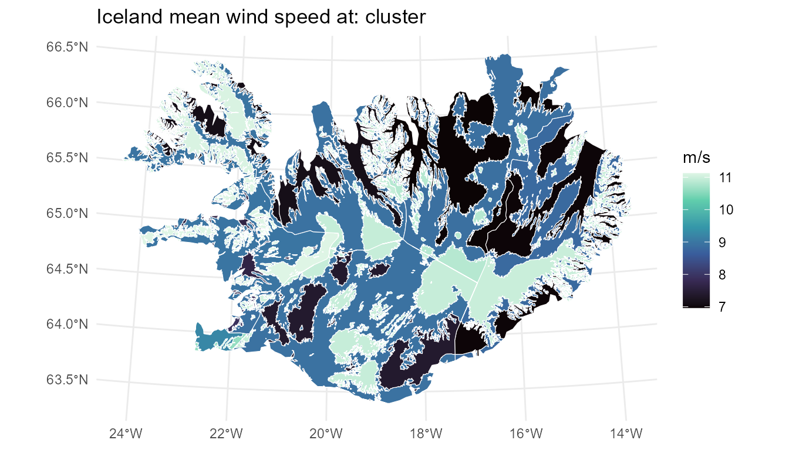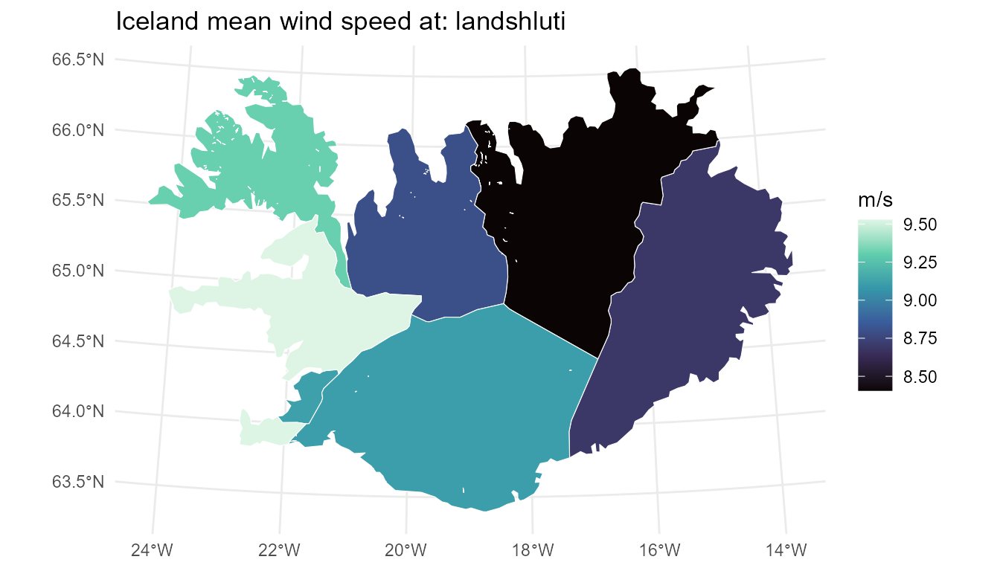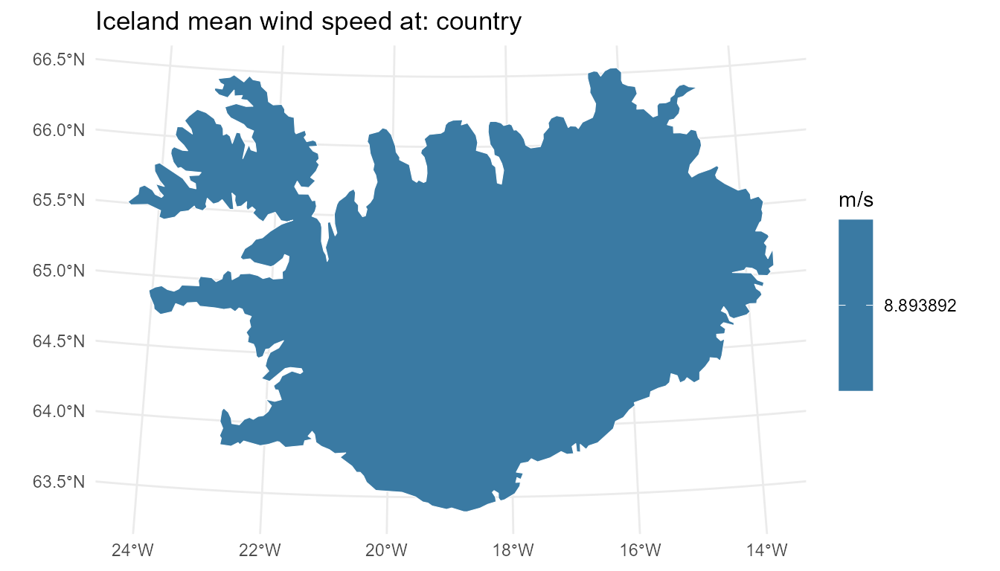

## See also

- [`vignette("geoscales")`](https://optimal2050.github.io/geoscales/r/articles/geoscales.md)
  — the 5-minute tour.
- [`vignette("data-manipulation")`](https://optimal2050.github.io/geoscales/r/articles/data-manipulation.md)
  — the conversion pipelines feeding these maps.
- timescales’ *Visualization with ggplot2* vignette — the temporal
  sibling: same contract, calendar heatmaps and wall calendars instead
  of choropleths.
