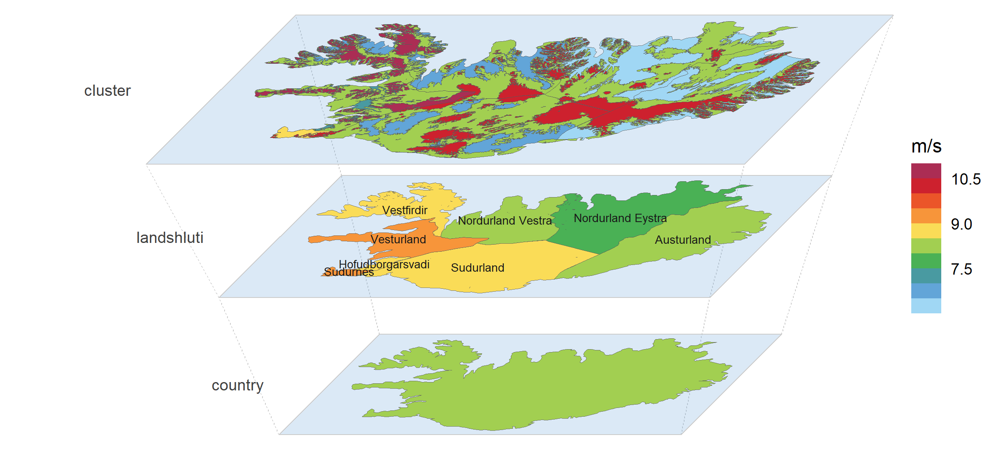
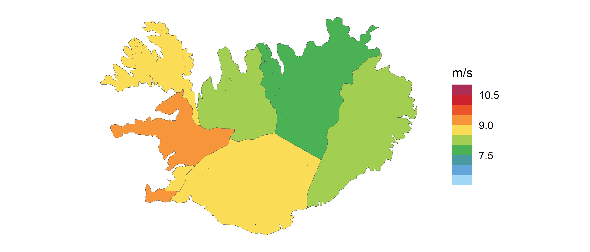
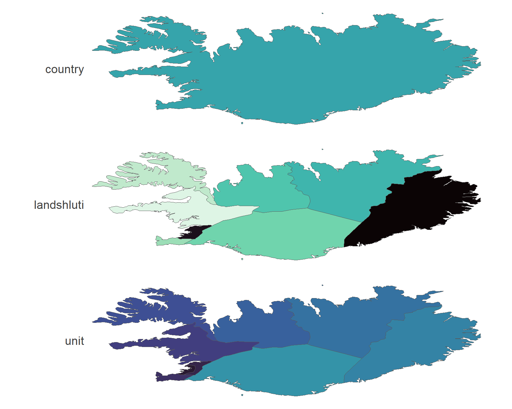

# geoscales

## Overview

geoscales provides **nested regions and spatial hierarchies** for
optimization and simulation models: organize the spatial dimension of
your model data, convert it between region systems, and see every level
at once.

- [`geoscale_from_leaftable()`](https://optimal2050.github.io/geoscales/r/reference/geoscale_from_leaftable.html)
  builds a `Geoscale` — ordered geoframes, their members, and one
  leaftable row per leaf region (“atom”) with its weights (area,
  population, capacity);
  [`ne_geoscale()`](https://optimal2050.github.io/geoscales/r/reference/ne_geoscale.html)
  builds one straight from Natural Earth, and
  [`attach_geometry_geoscale()`](https://optimal2050.github.io/geoscales/r/reference/attach_geometry_geoscale.html)
  adds boundaries from any source — the package ships integration code,
  not maps.
- [`join_geoscale()`](https://optimal2050.github.io/geoscales/r/reference/join_geoscale.html)
  decorates a table keyed by regions with the geoscale’s columns — your
  tables stay tables (data.frame, tibble, data.table, dtplyr/arrow in;
  the same class out).
- [`recast_geoscale()`](https://optimal2050.github.io/geoscales/r/reference/recast_geoscale.html)
  converts values between geoframes — up, down, and across cross-cutting
  region systems — one rule per value column, totals conserved.
- [`filter_geoscale()`](https://optimal2050.github.io/geoscales/r/reference/filter_geoscale.html)
  and
  [`prune_geoscale()`](https://optimal2050.github.io/geoscales/r/reference/prune_geoscale.html)
  carve region samples and coarser designs for model runs, with coverage
  bookkeeping.
- [`geom_geoscale()`](https://optimal2050.github.io/geoscales/r/reference/geom_geoscale.html)
  and
  [`geoscale_autoplot()`](https://optimal2050.github.io/geoscales/r/reference/geoscale_autoplot.html)
  draw any level: choropleths, icicles, and axonometric stacks.

geoscales is the spatial-domain package of the
[optimal2050](https://github.com/optimal2050) modeling stack; its time
companion, [timescales](https://github.com/optimal2050/timescales),
shares the same design and vocabulary.

If you are new to geoscales, the best place to start is the [get-started
vignette](https://optimal2050.github.io/geoscales/r/articles/geoscales.html)
([`vignette("geoscales")`](https://optimal2050.github.io/geoscales/r/articles/geoscales.md)).

## Installation

geoscales is not on CRAN yet; install the development version from
GitHub:

``` r

# install.packages("pak")
pak::pkg_install("optimal2050/geoscales")
```

## Usage

One `Geoscale`, three resolutions of the same country: Iceland’s onshore
wind resource (Global Wind Atlas, 100 m) clustered by wind speed within
each region — the whole hierarchy drawn as a single perspective stack,
every plane on the Global Wind Atlas palette at its absolute scale (from
[energypal](https://github.com/optimal2050/energypal)). Its time twin —
Reykjavik’s wind year on a calendar stack — opens the [timescales
README](https://github.com/optimal2050/timescales). The [get-started
vignette](https://optimal2050.github.io/geoscales/r/articles/geoscales.html)
shows how the cluster layer is built from the raster.



The same data moves between the levels by one verb —
[`recast_geoscale()`](https://optimal2050.github.io/geoscales/r/reference/recast_geoscale.md),
the same machinery that converts model tables — here the cluster values
as area-weighted means of each region’s resource area, on the flat map:



*Wind data: [Global Wind Atlas](https://globalwindatlas.info) — DTU, in
partnership with the World Bank Group, data by Vortex, funded by ESMAP.*

And building a `Geoscale` takes a leaftable and (optionally) a map —
here Iceland’s administrative hierarchy from Natural Earth, drawn as a
top-down stack:

``` r

library(geoscales)

ne <- ne_source(geoframe = "states", country = "Iceland")
d <- as.data.frame(ne)
iceland <- geoscale_from_leaftable(
  data.frame(country = "ISL", landshluti = d$gn_name,
             unit = d$iso_3166_2),
  geoframes = c("country", "landshluti", "unit"),
  key = "unit", name = "iceland"
) |>
  attach_geometry_geoscale(ne, by = "iso_3166_2", geoframe = "unit")

geoscale_autoplot(iceland, type = "stack", view = "top-down", gap = .35)
```



## Learning more

- The [get-started
  vignette](https://optimal2050.github.io/geoscales/r/articles/geoscales.html)
  — build, inspect, convert, visualize, plus the wind-cluster recipe
  behind the hero.
- [Concepts](https://optimal2050.github.io/geoscales/r/articles/concepts.html)
  — what makes space harder than time: geoframes need not nest, region
  codes are not unique across geoframes, and no maps are bundled.
- [Visualization](https://optimal2050.github.io/geoscales/r/articles/visualization.html)
  — choropleths, recasts seen on the map, stacks and icicles with data.
- The [project site](https://optimal2050.github.io/geoscales/) — entry
  point for all language flavours — and the [R
  reference](https://optimal2050.github.io/geoscales/r/reference/).

## Getting help

geoscales is pre-1.0 and APIs may still change between minor versions.
Questions, feedback, and bug reports are welcome on the [issue
tracker](https://github.com/optimal2050/geoscales/issues); see
[CONTRIBUTING](https://optimal2050.github.io/geoscales/r/CONTRIBUTING.md)
for the repository layout and the multi-language roadmap.

## License

Apache-2.0. See
[LICENSE](https://optimal2050.github.io/geoscales/r/LICENSE).
